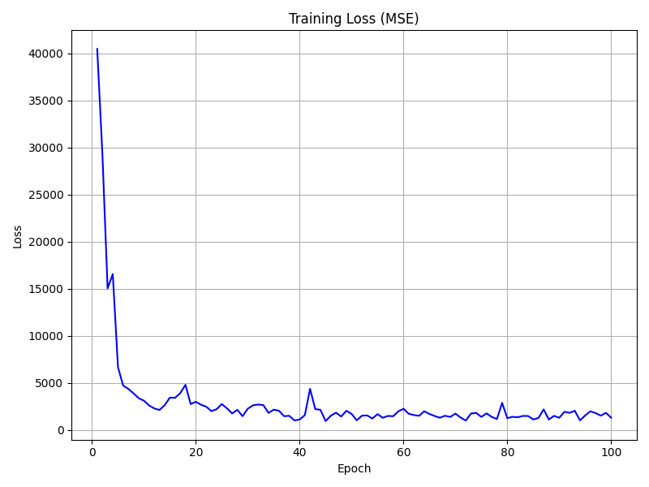
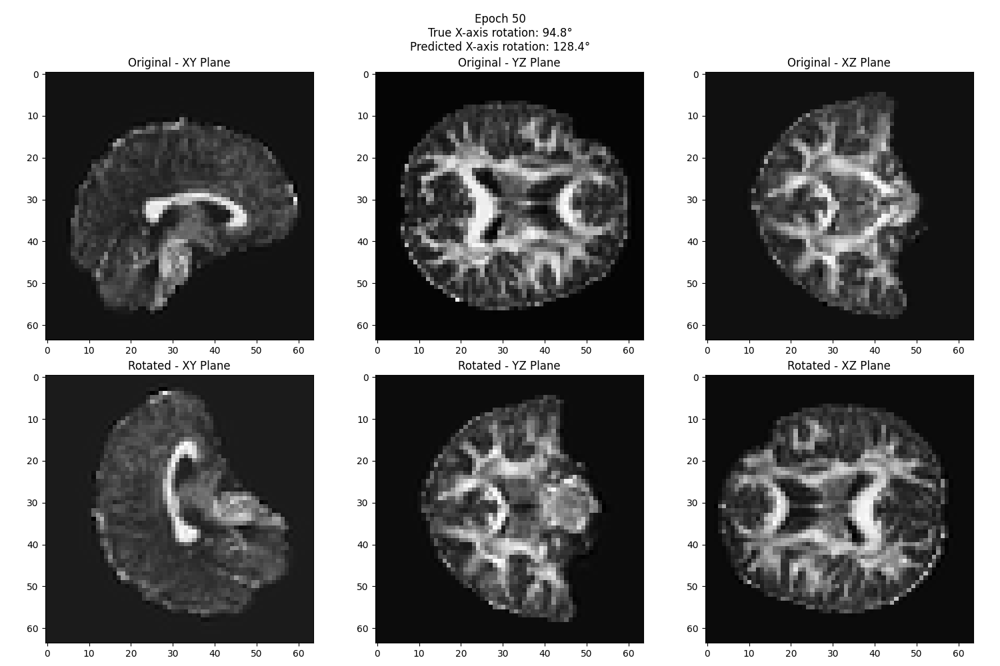

# RotNet-FA-Image

## Overview
RotNet-FA-Image is a Python-based deep learning project for predicting rotation angles of fractional anisotropy (FA) maps derived from NIfTI (.nii.gz) files. It leverages 3D convolutional neural networks (CNNs) implemented in PyTorch to regress rotation angles. The augmented data helps us extract meaningful features from the input data.

Original RotNet repo: https://github.com/d4nst/RotNet

## Environment
- Ubuntu version: 22.04.4 LTS 
- CUDA version: 12.2
- GPU: NVIDIA RTX A4000

## Installation
```
# Create and activate a new conda environment
conda create -n isbi_challenge python=3.10 -y
conda activate isbi_challenge

# Install PyTorch with CUDA support
conda install pytorch torchvision torchaudio pytorch-cuda=12.1 -c pytorch -c nvidia

# Install additional dependencies
pip3 install -r requirements.txt
```

## Project Structure
- `NiiDataset`: Custom PyTorch Dataset class for loading and preprocessing NIfTI files.
- `RotationRegressionModel`: 3D CNN for predicting rotation angles.
- `Training Script`: Handles the training process, model evaluation, and visualization.

## Running the Model
- Prepare your dataset of .nii.gz files and place them in the data directory. (default: `./data`)
- Train the model using the provided training script:
```python
python3 rotnet3D_regression.py
```
- The model's training progress will be logged, and visualization outputs will be saved in the result_regression directory.

## Outputs
- Useful Feature: Saved as `vectors.npy`, containing the last layer of fully connected layer's weights
- Training History: Plots of the mean squared error (MSE) loss over epochs.


- Visualizations: Image without rotation and image with ground truth rotation / Ground truth rotation and the predicted rotation for epoch 1, 25, 50, 75, 100





